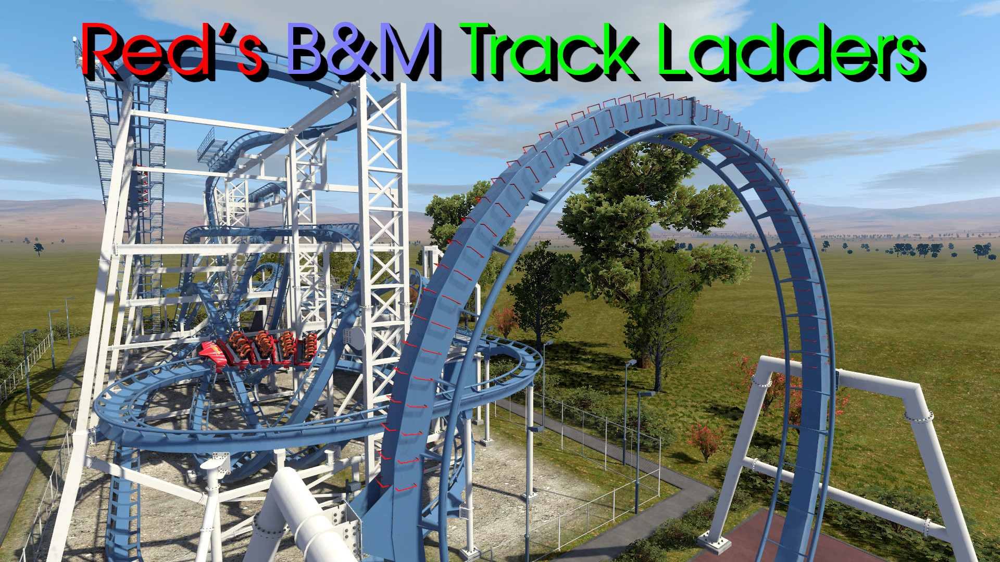

___

#### Description:
"Red's B&M Track Ladders" is a NoLimits 2 Roller Coaster Simulator (NL2) custom scenery object (SCO) package of scripted ladder rungs that attach to the spine of B&M track.

___

#### Notes:

- This repository is mainly to help with versioning. Easier places to download this pack are either the [Steam Workshop page](https://steamcommunity.com/sharedfiles/filedetails/?id=3411637289) or ~~the [NoLimits Central page](https://nolimitscentral.com/exchange/park/TODO)~~.
